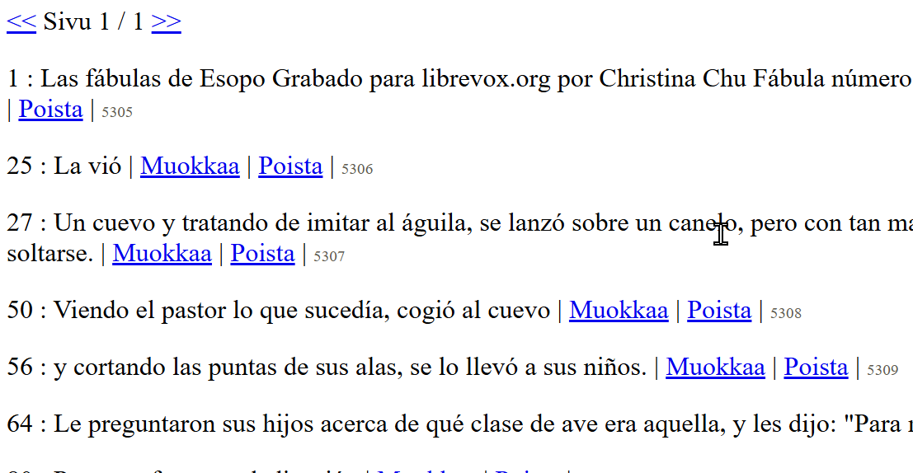

# Ai-litteroinnit

Ai avusteisten litterointien hallintasovellus.
Esimerkiksi ms word:in tekemät litteroinnit äänitiedostosta.
Mahdollistaa ai-avusteisten litteroinnin tarkastuksen ja korjauksen.


## Sovelluksen toiminnot

* Käyttäjä pystyy luomaan tunnuksen ja kirjautumaan sisään sovellukseen.
* Käyttäjä pystyy lisäämään, muokkaamaan ja poistamaan litterointeja.
* Litteroinnin tiedot koostuu alkuperäisen ääntiedoston tiedostonimestä  (tai netti urlista), tiedoston sisällön otsikosta sekä litteroidusta tekstistä aikakoodeineen, lajityyppitiedosta ja tekstityksen lähteen muodosta (youtube, WebVTT ja ms word tuettu automaattista pilkontaa varten)
* käyttäjä voi muokata ja korjata litteroinnin tekstejä
* Käyttäjä näkee sovellukseen lisätyt litteroinnit
* Käyttäjä pystyy etsimään litteroitujen tekstien sisältöjä
* Sovelluksessa on käyttäjäsivut, jotka näyttävät käyttäjän lisäämät litteroinnit
* Käyttäjä voi lisätä metatietoja litterointiin: äänitiedoston pituus, äänitteen päivämäärä, vapaamuotoinen metatieto merkkijono 
* käyttäjä voi lisätä litterointia vastaavan äänitiedoston
* käyttäjä voi kuunnella litterointia vastaavaa äänitiedostoa ja tarkistaa litterointitekstejä samalla sivulla (ei vielä oikein toimi youtube formaatti valinnalla)
* äänitiedoston soitto hyppää tekstityksen aikakoodilinkin mukaiseen aloituskohtaan
* sivutetut tekstisrivit sivun vaihto seuraavaan hypyttää myös äänitiedoston alkukohdan halutun sivun alkuun
* haku tekstin sisällöillä, litteroinnin otsikoista, tiedostonimellä
* tekstinsisältö haun tuloksista linkitys tulosriviä vastaavaan litteroinnin sivutettuun sivuun
* tilastosivu näyttää litterointien lukumääriä lajityypin, käyttäjien ja litteroinnin lähdeformaatin mukaan
* tekstirivi muokkaukset versiodaan (mahdollistaa kaikkien aikaisempien versioiden säilytyksen tietokannassa ja tarvittaessa palautusmahdollisuuden (suoraan tiedokannassa))
* teksti fragmenttien muokkaus päivämäärät ja muokkaajan käyttäjänimet tallentuu tietokantaan
* filtteröidyt listaussivut lajityypin, lähdeformaatin ja käyttäjien mukaan suoraan tilastot sivulta
* mahdollisuus luoda litteroinnin tekstirivit suoraan manuaalisesti tyhjästä
* mahdollisuus antaa litterointikohtaisesti muokkaukseen mahdollisuus myös muille sovellukseen kirjautuneille (oletuksena että vain litteroinnin luoja voi muokata)

## TODO

* Käyttäjä pystyy valitsemaan litteroinnille lisää luokitteluita (esim litteroinnin kieli)
* näytä tekstirivin muokkaus päivämäärä
* aikaisemman tekstirivin muokkaus version palautus käyttöliittymästä
* upotettu youtube video
* litterointikohtainen tekstihaku


## Sovelluksen asennus

Asenna `flask`kirjasto:

```
$ pip install flask
```

Luo tietokannan taulut ja lisää alkutiedot:

```
$ sqlite3 database.db < schema.sql
$ sqlite3 database.db < seed.sql
```

seed.sql sisältää kaksi litterointia. Yksi youtubesta ja yksi word transcribesta.
Seed lisää myös testikäyttäjän: tunnus on testi-user salasana on testi-user.

Voit käynnistää sovelluksen näin:

```
$ flask run
```


## Käyttöohjeet

Toimii tällä hetkellä Youtube automaattisilla tekstityksillä, WebVTT formaatilla ja word:in transcribe toiminnolla. 

### Youtube  
kopioi teksti esim Chrome dev toolista.
Aktivoi tekstitykset:


ja kopioi dev toolin network ikkunasta json 


ja liitä Aikaleimattu teksti tekstikenttään.


### Word 

Kopioi transcribe toiminnon tulos aikaleimoilla


ja liitä Aikaleimattu teksti tekstikenttään.


## Aikaleimatut tekstit

Kun tekstityksen raakadata on kopioitu sovellukseen aja "Luo teksti fragmentit" joka pilkkoo tekstipätkät aikakoodatuksi riveiksi.
Jonka jälkeen jokaista aikaleimattua tekstikokonaisuutta voi muokata erikseen.




## 