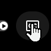
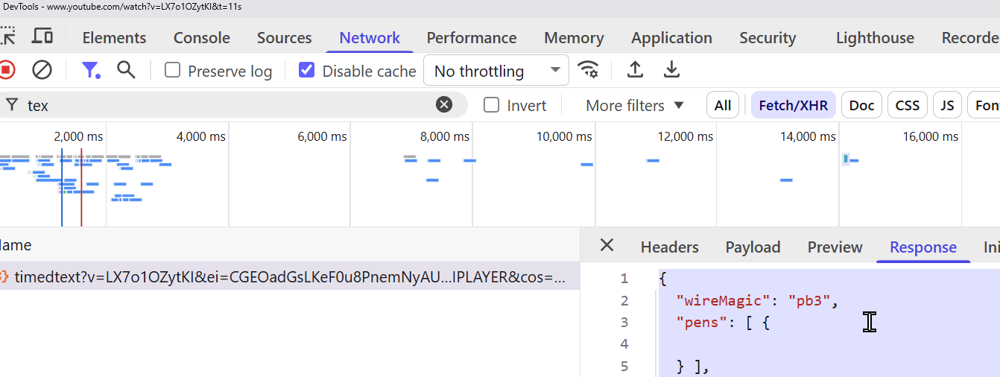
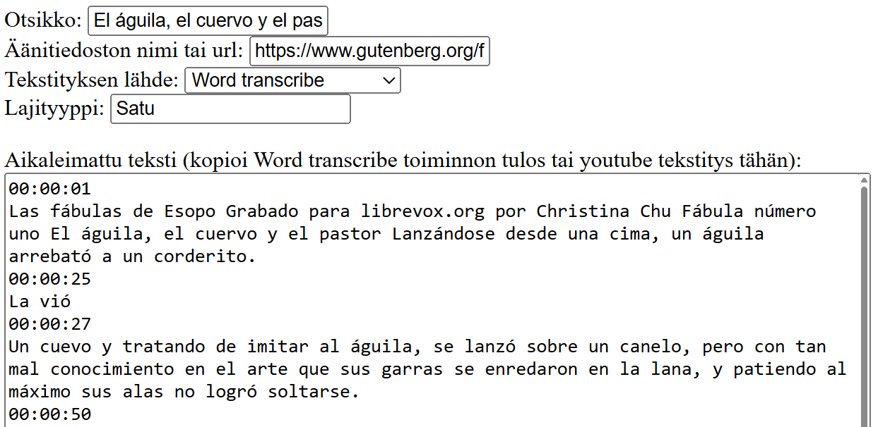

# Ai-litteroinnit

Ai avusteisten litterointien hallintasovellus.
Esimerkiksi ms word:in tekemät litteroinnit äänitiedostosta.

## Sovelluksen toiminnot

* Käyttäjä pystyy luomaan tunnuksen ja kirjautumaan sisään sovellukseen.
* Käyttäjä pystyy lisäämään, muokkaamaan ja poistamaan litterointeja.
* Litteroinnin tiedot koostuu alkuperäisen ääntiedoston tiedostonimestä  (tai netti urlista), tiedoston sisällön otsikosta sekä litteroidusta tekstistä aikakoodeineen
* käyttäjä voi muokata ja korjata automaattisen litteroinnin tekstejä
* Käyttäjä näkee sovellukseen lisätyt litteroinnit.
* Käyttäjä pystyy etsimään litteroitujen tekstien sisältöjä

## TODO
* Sovelluksessa on käyttäjäsivut, jotka näyttävät tilastoja ja käyttäjän lisäämät litteroinnit.
* Käyttäjä pystyy valitsemaan litteroinnille yhden tai useamman luokittelun (litteroinnin kieli, äänitiedoston sisällön genre (esim luento).
* lisää metatietoja litterointiin: äänitiedoston pituudesta, äänitteen päivämäärästä, litteroinnin muokkauspäivämäärät
* tekstin muokkaus päivämäärä
* haku äänitiedoston nimellä ja otsikoista


## Sovelluksen asennus

Asenna `flask`kirjasto:

```
$ pip install flask
```

Luo tietokannan taulut ja lisää alkutiedot:

```
$ sqlite3 database.db < schema.sql
$ sqlite3 database.db < init.sql
```

Voit käynnistää sovelluksen näin:

```
$ flask run
```


## Käyttöohjeet

Toimii tällä hetkellä Youtube automaattisilla tekstityksillä ja word:in transcribe toiminnolla. 

### Youtube  
kopioi teksti esim Chrome dev toolista.
Aktivoi tekstitykset:


ja kopioi dev toolin network ikkunasta json 


ja liitä Aikaleimattu teksti tekstikenttään.


### Word 

Kopioi transcribe toiminnon tulos aikaleimoilla


ja liitä Aikaleimattu teksti tekstikenttään.


